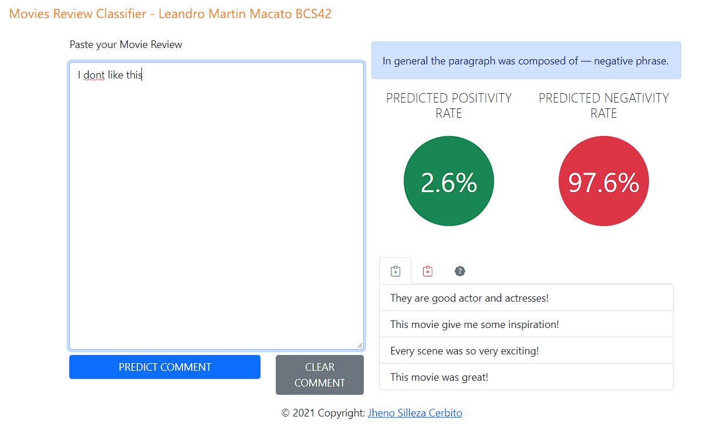

---
# RNN-Movie-Review-Classifier
---

# A simple webapp on sentiment analysis using RNN Convolutional Neural Network layers utilizing the MLBD movie review sentiment dataset.
### Download Links
Word Vectorization
https://s3.amazonaws.com/dl4j-distribution/GoogleNews-vectors-negative300.bin.gz
Dataset
https://www.kaggle.com/lakshmi25npathi/imdb-dataset-of-50k-movie-reviews

### Reference
https://github.com/Senpaixyz/Movie-Review-Classifier-Web-Application